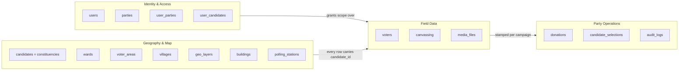
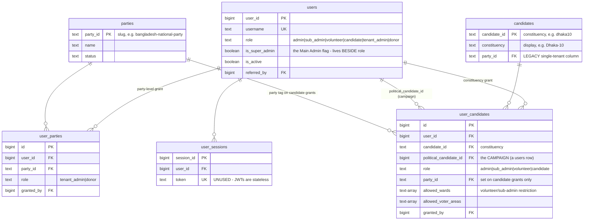
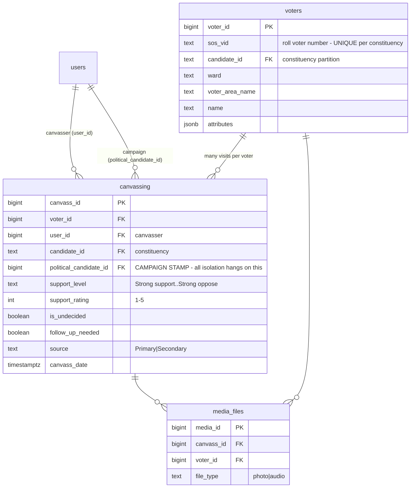
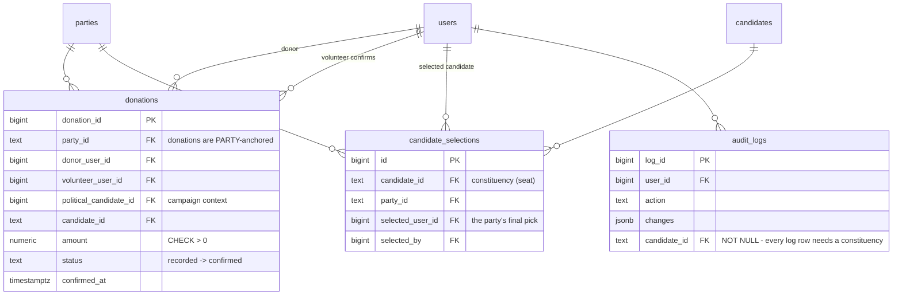
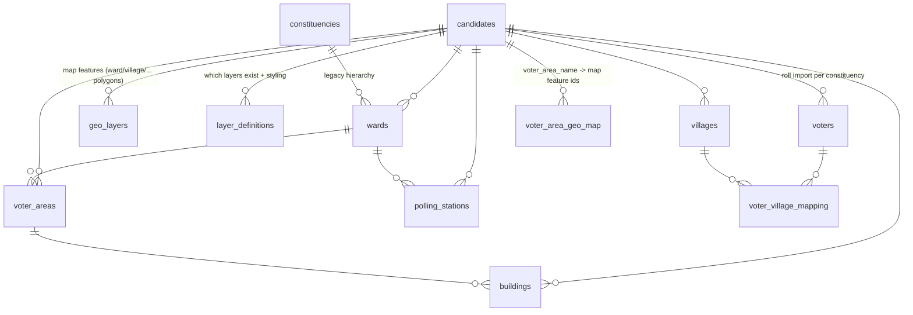

# ER diagrams

> Column-level truth: [schema.generated.md](schema.generated.md) (regenerate with
> `node server/scripts/generate-schema-docs.js`). Semantics: [tables.md](tables.md).

**Read this first:** the table named `candidates` holds **constituencies**
(Dhaka-10, Dhaka-8, …), *not* people — the name survives from the app's
single-tenant era when one deployment = one candidate. A person running for
office is a `users` row (`role='candidate'`), and a **campaign** is identified
by that person's `user_id` carried in `political_candidate_id` columns. Keep
this translation in mind for every diagram below.

## Overview — the four domains

Nearly every table carries a `candidate_id → candidates.candidate_id` column
(**constituency partition key**, `ON DELETE CASCADE`): data is physically
partitioned per constituency, then *logically* partitioned per campaign by
`political_candidate_id` and per party by `party_id`.

## Identity & access (the RBAC core)

The natural key of `user_candidates` is
`UNIQUE NULLS NOT DISTINCT (user_id, candidate_id, political_candidate_id)` —
**one grant per (person, constituency, campaign)**. That is what lets one
volunteer serve several campaigns (even across parties) with separate
ward/area assignments per campaign.

## Field data (voters & canvassing)

- A voter may be canvassed **many times** (visit history) and **by several
  campaigns** — cross-party voter matching joins rolls on `sos_vid`.
- `political_candidate_id` NULL = legacy pre-campaign canvass (still rendered,
  shown unattributed in cross-party views).

## Party operations

`candidate_selections` is `UNIQUE (candidate_id, party_id)` — re-selecting
replaces the pick; the §8 handover transaction re-points canvassing,
donations, and team grants from the losing campaigns to the winner.

## Geography & map stack

The **live** map stack is `layer_definitions` (which layers a constituency
has, their hierarchy and styling) + `geo_layers` (one row per map feature,
GeoJSON in `geometry`, drill-down via `parent_layer_key`/`parent_feature_id`)
+ `voter_area_geo_map` (joins a voter's `voter_area_name` string to feature
ids). The `wards` / `voter_areas` / `villages` / `constituencies` /
`buildings` / `polling_stations` tables are the older normalized geography
from the single-tenant apps — mostly empty in current deployments (see row
counts in schema.generated.md) but still referenced by some endpoints.
Voters' geography lives denormalized on the voter row itself
(`ward`, `voter_area_name`, `union`, …) matching the imported roll.
