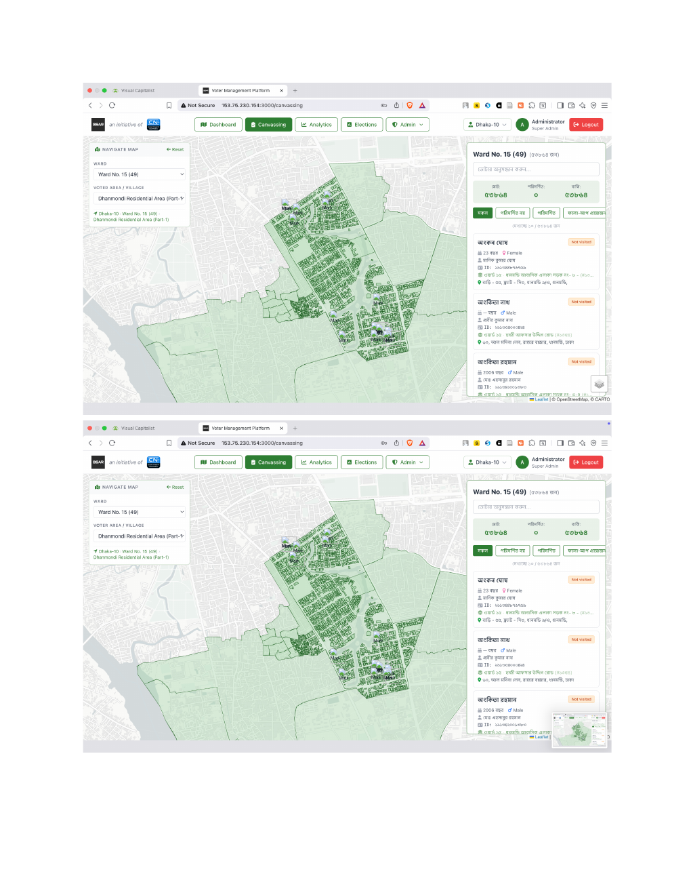
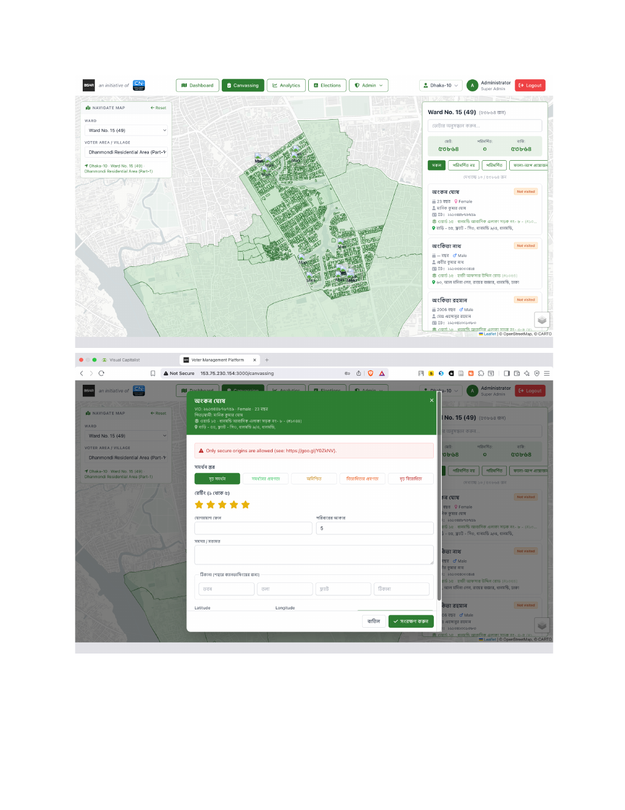
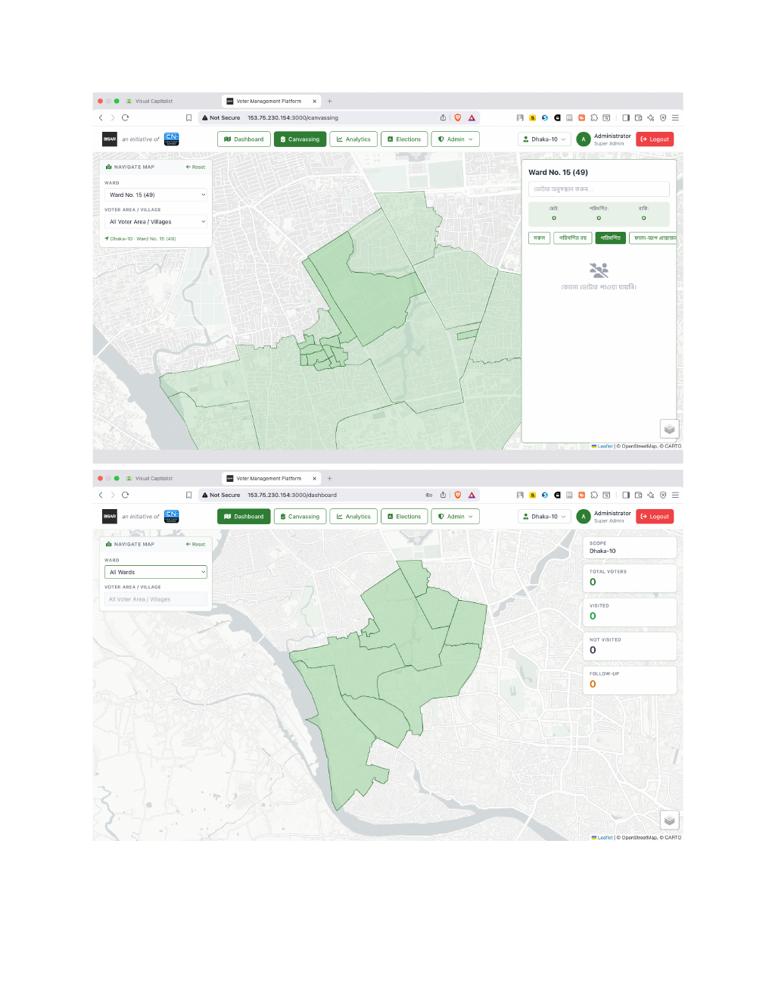
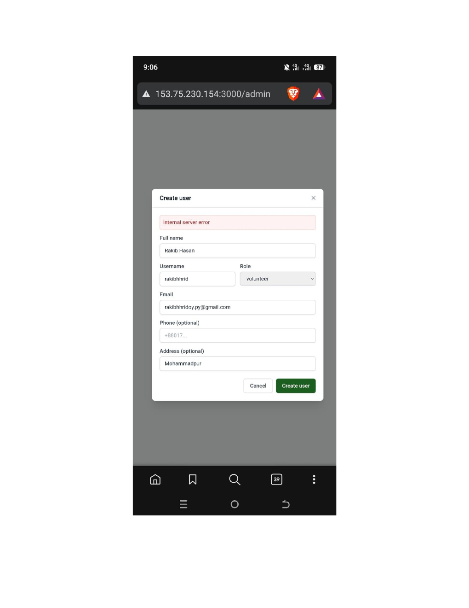

# Dhaka South — Fix Plan

Implementation plan for the 16 reported issues (see [ISSUES.md](../../ISSUES.md)).
Source doc + screenshots stored in this folder:
- [dhakasouthapplication.pdf](dhakasouthapplication.pdf)
-  ·  ·  · 

Legend: 🟢 no blockers · 🟡 needs a decision/input from you · 🔴 hard prerequisite

---

## Prerequisite — HTTPS (blocks the whole geo cluster) 🔴

The canvass form shows **"Only secure origins are allowed"** (screenshot 02) because
the app runs on plain **HTTP** (`153.75.230.154:3000`). Browsers disable the
**Geolocation API** off HTTPS, so **#4, #6, #8 cannot work** until this is fixed.

**Options (need your decision):**
1. **Point a domain + Caddy/Nginx reverse proxy with Let's Encrypt** (recommended — free auto-TLS). Requires a domain name aimed at the server IP.
2. **Cloudflare Tunnel** — HTTPS without opening ports / managing certs. Requires a Cloudflare account + domain.
3. **Self-signed cert** — works but shows a browser warning every visit (poor UX; fine only for internal testing).

➡️ **What I need from you:** a domain name (or "use Cloudflare", or "self-signed for now").

---

## Phase 1 — Quick wins (no dependencies) 🟢

### #7 — Logo links (BSAR / CN)
- **Approach:** wrap the two header/login logos in links.
- **Files:** `client/src/components/AppHeader.jsx`, `Navbar.jsx`, `pages/LoginPage.jsx`.
- 🟡 **Need:** the target URLs for BSAR and Centrist Nation (or default both to `/dashboard`).

### #16 — Hard delete + better duplicate-username error
- **Root cause:** the `/admin` user path likely soft-deletes (or a unique-username 23505 surfaces as "Internal server error" — screenshot 04).
- **Approach:** make admin user delete a hard delete (consistent with the candidate/volunteer delete we already ship); map Postgres `23505` (unique_violation) to a friendly "এই username আগে থেকেই আছে" message in the error handler.
- **Files:** `server/src/controllers/adminController.js` (or user controller), `server/src/models/userModel.js`, central error middleware.

### #14 — Role hierarchy on user creation
- **Root cause:** create-user role dropdown offers all roles regardless of the creator (screenshot 04 shows a volunteer-creatable form on `/admin`).
- **Approach:** backend guard — admin/super-admin may create any role; sub-admin may create only `volunteer`; volunteer/candidate may create none. Frontend: filter the role `<select>` by the creator's role.
- **Files:** user-create controller (server), the admin create-user modal (client).

---

## Phase 2 — Canvassing status & stats cluster (high value) 🟢

### #15 — Dashboard stats zero on the initial all-ward view
- **Root cause (confirmed):** `DynamicDashboard.jsx` early-returns `setStats(null)` when there's no ward scope and no filters — so the whole-constituency view shows 0.
- **Approach:** on initial load (no ward/filter) fetch constituency-wide stats (scoped by `political_candidate_id`). Same for `DynamicCanvassing`.
- **Files:** `client/src/pages/DynamicDashboard.jsx`, `DynamicCanvassing.jsx`; confirm `votersApi.filtered` handles an empty scope.

### #9 — "poridorshito" (visited) count zero + status head-filter not filtering
- **Root cause:** the voter-list status counts/tabs read the shared `voters.status`, which isn't maintained once a constituency has multiple candidates (submit only writes `voters.status` when there's no `political_candidate_id`). Per-candidate status must come from `canvassing` joined on `political_candidate_id` (the `findByFilters` path already does this for the list; the count tabs + filter wiring need the same).
- **Approach:** compute visited / not-visited / follow-up counts from canvassing scoped to the active political candidate; wire the status tabs to actually filter the list.
- **Files:** `client/src/components/canvassing/FilteredVoterListPanel.jsx`, `server/src/models/voterModel.js` (filter-options/counts), voter controller.

### #3 — Row status not updating instantly after submit
- **Root cause:** after a canvass submit the list isn't refetched/optimistically updated, and (per #9) status derives from canvassing.
- **Approach:** on submit success, optimistically set the row's status and/or refetch the affected page of the list.
- **Files:** `CanvassFormModal.jsx`, `FilteredVoterListPanel.jsx`, `DynamicDashboard/Canvassing`.

---

## Phase 3 — Canvass form UX 🟢

### #1 — Open the canvass form directly from the voter table
- **Root cause:** clicking a voter drops a map pin; the form only opens on the pin click.
- **Approach:** make a voter row's primary action open `CanvassFormModal` directly (keep the pin as secondary/locate).
- **Files:** `VoterCard.jsx`, `FilteredVoterListPanel.jsx`, `DynamicDashboard/Canvassing`.

### #10 — Multiple voter (family) search & add in the canvass form
- **Approach:** add a multi-voter picker to the form (search voters in the same building/area, select several household members); submit creates a canvass per selected voter with the shared location/answers.
- **Files:** `CanvassFormModal.jsx` (+ a voter-search API scoped to the building/area), `canvassingModel.submit` (accept a batch).

---

## Phase 4 — Geolocation cluster (needs HTTPS prerequisite) 🔴→🟢

### #4 — Per-voter building geolocation on canvass
- **Approach:** when canvassing at a building, persist that building's `building_id` + lat/long on the canvass and treat it as the voter's location thereafter; on next view, center/pin the voter at that building.
- **Files:** canvass submit (already stores `building_id`/lat/long — wire read-back), voter read to prefer the canvassed building location.

### #6 — Colorize canvassed buildings + per-building voter stats
- **Root cause:** `map_config` already supports `color_by: 'canvassed'` (see `DynamicMap.styleFor`), but the building layer isn't fed a `canvassed` flag or stats.
- **Approach:** backend building layer returns `canvassed` (bool) + voter counts per building, scoped to the political candidate; frontend colors buildings and shows a per-building stats popup.
- **Files:** `server/src/models/geoLayerModel.js` / `genericGeoModel.js`, `DynamicMap.jsx`.

### #8 — Canvasser geolocation marker
- **Approach:** use `navigator.geolocation.watchPosition` (HTTPS only) to show a live "you are here" marker on the map.
- **Files:** `DynamicMap.jsx`, dashboard/canvassing pages.

---

## Phase 5 — Bangla transliteration search 🟢

### #11 — Avro phonetic English→Bangla search
- **Approach:** integrate a client-side phonetic transliterator (Avro-style) so typing `arkan` finds `অর্কন`; transliterate the query before hitting search (and/or search both raw + transliterated).
- **Files:** voter-search input components; a small transliteration util or a vetted JS library bundled locally (offline-safe).

---

## Phase 6 — Role-based region assignment hierarchy (largest) — CONFIRMED ✅

Covers **#12 (role-based region assignment)** and **#14 (role hierarchy on creation)**.

### The 5-level hierarchy (confirmed with user)

```
Super Admin  (platform operator)
   │  assigns → one Candidate to multiple CONSTITUENCIES
   ▼
Candidate  [role='candidate']  — political person, owns the data (political_candidate_id)
   │  creates Campaign Admin + assigns them CONSTITUENCIES (subset of candidate's, multiple)
   ▼
Campaign Admin  [role='admin']  — scoped to the CONSTITUENCY(ies) given by the candidate
   │  assigns WARDS (within its constituencies) to Sub-admins (multiple)
   ▼
Sub-admin  [role='sub_admin']  — scoped to assigned WARD(s)
   │  creates/handles Volunteers + assigns them VOTER AREAS (within its wards)
   ▼
Volunteer  [role='volunteer']  — scoped to assigned VOTER AREA(s) + WARD(s); does the canvassing
```

Everything sits under one `political_candidate_id` (the candidate is the data tenant); campaign
admin / sub-admin / volunteer all operate within that candidate's data.

### Region granularity per level (assign only within what you were given)
| Level | Scoped to | Assigns to child |
|-------|-----------|------------------|
| Super Admin | everything | constituency → Candidate |
| Candidate | its constituencies | constituency → Campaign Admin |
| Campaign Admin | its constituencies | **ward** → Sub-admin |
| Sub-admin | its wards | **voter area** → Volunteer |
| Volunteer | its voter areas (+ wards) | — |

### Who can create whom (down the hierarchy only — #14)
- Super Admin → anyone
- Candidate → Campaign Admin, Sub-admin, Volunteer
- Campaign Admin → Sub-admin, Volunteer
- Sub-admin → Volunteer only
- Volunteer → nobody

### Who sees what
Each level sees ONLY the region assigned from above: Candidate → all its constituencies · Campaign
Admin → assigned constituencies · Sub-admin → assigned wards · Volunteer → assigned voter areas (+ ward).

### Data-model changes
- `user_candidates`: add **allowed voter areas** (alongside existing `allowed_wards`) for volunteers;
  campaign-admin scope = its `candidate_id` grants, sub-admin scope = `allowed_wards`.
- Use existing `granted_by` to record the assignment chain so scope cascades (you can only assign
  regions you hold).
- Auth payload: carry the caller's region scope (constituencies / wards / voter areas) per active grant.
- Reuse the `allowed_wards` map/voter-list restriction already shipped; extend it to voter-area level.

### 🔴 NEW REQUIREMENT — single unified management page
The **separate** pages we built won't be used:
- `client/src/pages/admin/PoliticalCandidatesPage.jsx` (candidate create/manage)
- `client/src/pages/candidate/VolunteerManagementPage.jsx` (volunteer create/manage)
- (and the `/admin` user page)

➡️ Replace them with **ONE management page** where everything is handled from a single place —
create/manage users at every level of the hierarchy, assign regions (constituency / ward / voter
area) down the chain, all role-aware (a logged-in user only sees the levels + regions they control).
This becomes the home for #12 + #14 (and folds in the existing candidate/volunteer/user management).

---

## Phase 7 — Email (SMTP) 🟡

### #13 — Enable SMTP with Google app password
- **Root cause:** `EMAIL_ENABLED=false`; nodemailer transport not configured in prod.
- **Approach:** wire nodemailer with Gmail + app password; set `EMAIL_ENABLED=true` and creds in prod env; add a test-send.
- 🟡 **Need:** the Gmail address + app password (or preferred SMTP provider).

---

## Phase 8 — Mobile responsiveness 🟢 (large)

### #2 — Make the app mobile responsive
- **Approach:** the layout is desktop-first (absolutely-positioned map side panels, fixed widths). Convert the map side panels to bottom-sheet/drawer on small screens, make the header nav collapse to a menu, and make the voter list + forms fluid. Tailwind breakpoints throughout.
- **Files:** `AppLayout`, `AppHeader`, `DynamicDashboard/Canvassing`, `FilteredVoterListPanel`, modals.

---

## Suggested order

1. **Phase 1** (quick wins) — same day.
2. **Phase 2** (status/stats) — highest field impact.
3. **Phase 3** (canvass form UX).
4. **HTTPS prerequisite**, then **Phase 4** (geo).
5. **Phase 5** (search) → **Phase 6** (hierarchy) → **Phase 7** (email) → **Phase 8** (mobile).

## Inputs I need to start
- [ ] BSAR + CN logo URLs (#7)
- [ ] HTTPS approach: domain name / Cloudflare / self-signed (#4, #6, #8)
- [x] ~~Hierarchy confirmation for #12~~ — CONFIRMED (see Phase 6)
- [ ] Gmail + app password for #13

## Decisions locked in
- Hierarchy: Super Admin → Candidate → Campaign Admin (`admin`, constituency-scoped) →
  Sub-admin (ward-scoped) → Volunteer (voter-area-scoped). See Phase 6.
- Phase 6 delivers a **single unified management page** replacing the separate
  candidate/volunteer/user pages.
- Starting order (agreed): Phase 2 (#15, #9, #3) + quick security fix #14 first.
